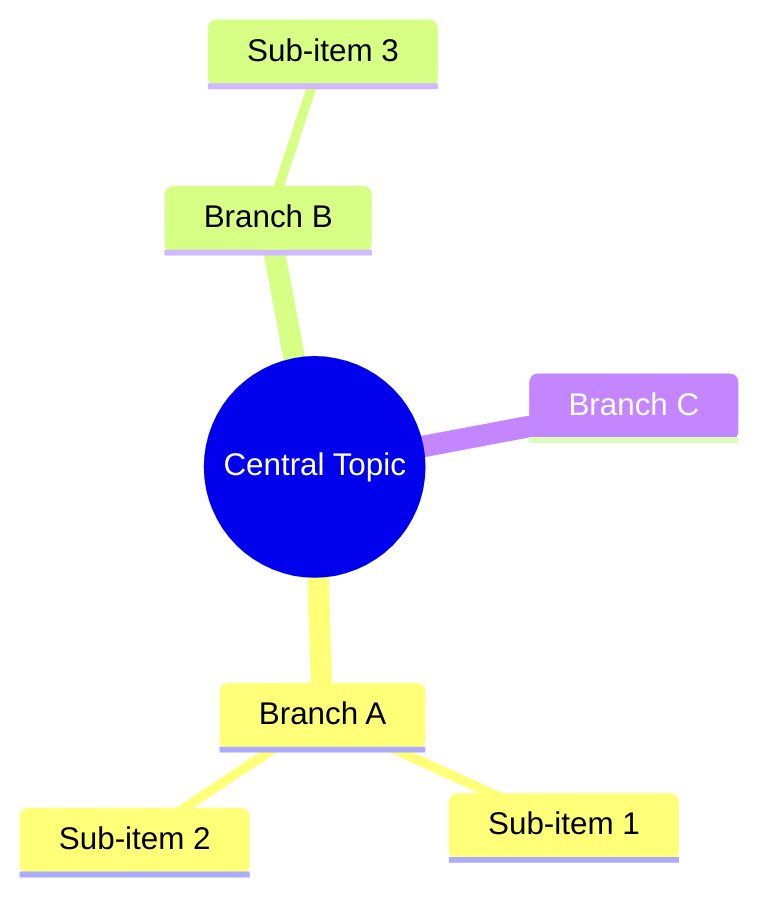
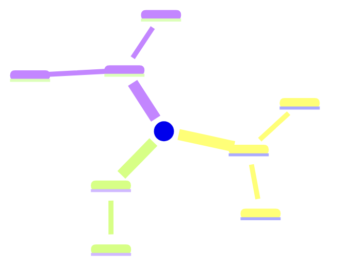

## Obsidian Mindmap Skill

Creates **Mermaid mindmap** diagrams embedded in Obsidian Markdown notes.
Obsidian renders Mermaid natively — no plugins required.

Vault location: `/Users/yuxinli/Documents/Vault/Research`
Helper script: `~/.copilot/skills/obsidian-mindmap/mindmap_gen.py`

---

### Mermaid Mindmap Syntax

Obsidian supports Mermaid mindmaps using indentation-based nesting:

````markdown

````

**Node shape options:**
| Syntax | Shape |
|---|---|
| `(( text ))` | Circle — use for root |
| `( text )` | Rounded rectangle |
| `[ text ]` | Square |
| `{{ text }}` | Hexagon |
| `> text` | Bang / callout |
| `text` | Default rectangle |

---

### Generating Mindmaps with the Script

**Topic mindmap (general concept overview):**
```bash
python3 ~/.copilot/skills/obsidian-mindmap/mindmap_gen.py \
  --topic "Machine Learning" \
  --keywords "Supervised Learning,Unsupervised Learning,Reinforcement Learning,Deep Learning,Evaluation"
```

**Paper analysis mindmap:**
```bash
python3 ~/.copilot/skills/obsidian-mindmap/mindmap_gen.py \
  --paper "Attention Is All You Need" \
  --authors "Vaswani et al." \
  --year "2017" \
  --keywords "Self-Attention,Multi-Head Attention,Positional Encoding,Encoder,Decoder" \
  --contributions "Eliminates recurrence,Parallelizable training,State-of-the-art NLP" \
  --methods "Scaled dot-product attention,Feed-forward layers,Layer normalization"
```

**Save directly to the vault:**
```bash
python3 ~/.copilot/skills/obsidian-mindmap/mindmap_gen.py \
  --topic "Federated Learning" \
  --keywords "Privacy,Communication Efficiency,Model Aggregation,Security,Non-IID Data" \
  --save
```
Saves to `~/Documents/Vault/Research/Topics/MindMap - Federated Learning.md`
For papers, saves to `~/Documents/Vault/Research/Papers/MindMap - <title>.md`

---

### Generating Mindmaps from AI Reasoning (no script needed)

When the user asks to create a mindmap for a topic you can reason about, write the Mermaid block directly into an Obsidian note without using the script. Use this template:

````markdown
---
title: "<Topic> - Mind Map"
tags: ["mindmap", "diagram", "<topic-tag>"]
date-created: <YYYY-MM-DD>
type: mindmap
---

# 🧠 <Topic>

## Concept Map



## Notes

_Add your thoughts, connections, and observations here._

## Related Notes

- [[Related Note 1]]
````

Then save the note to the vault:
```bash
cat > "/Users/yuxinli/Documents/Vault/Research/Topics/MindMap - <Topic>.md" << 'EOF'
<full note content>
EOF
```

---

### Combining with the `fetch-research-papers` Skill

To **fetch a paper and immediately generate a mindmap** from it:

1. Use `fetch-research-papers` to get the paper's title, keywords, and abstract.
2. Extract the key concepts, methods, and contributions from the abstract.
3. Use the mindmap script or write Mermaid directly to create the paper mindmap note.
4. Save to `Papers/MindMap - <Year> - <Short Title>.md`.

---

### Standard Mindmap Templates

**For a research paper:**
```
root((Paper Title))
  Publication
    Authors
    Year
    Journal
  Key Concepts
    Concept 1
    Concept 2
  Methodology
    Approach
    Dataset
    Evaluation
  Contributions
    Main Finding 1
    Main Finding 2
  Limitations
    Limitation 1
  My Thoughts
    Questions
    Applications
    Connections
```

**For a research topic:**
```
root((Topic Name))
  Definition
  History
    Origin
    Milestones
  Key Methods
    Method A
    Method B
  Applications
    Use Case 1
    Use Case 2
  Challenges
    Open Problem 1
  Key Papers
    [[Paper Note 1]]
    [[Paper Note 2]]
  Future Directions
```

---

### Tips

- Keep node labels **short** (2–5 words) for readability.
- Use `[[wikilinks]]` inside node labels to link to other Obsidian notes.
- Mindmaps render in Obsidian's **Reading View** — switch to it with `Ctrl/Cmd + E`.
- For complex maps, break branches into separate mindmap notes and link them.
